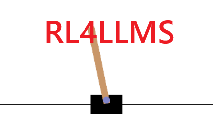
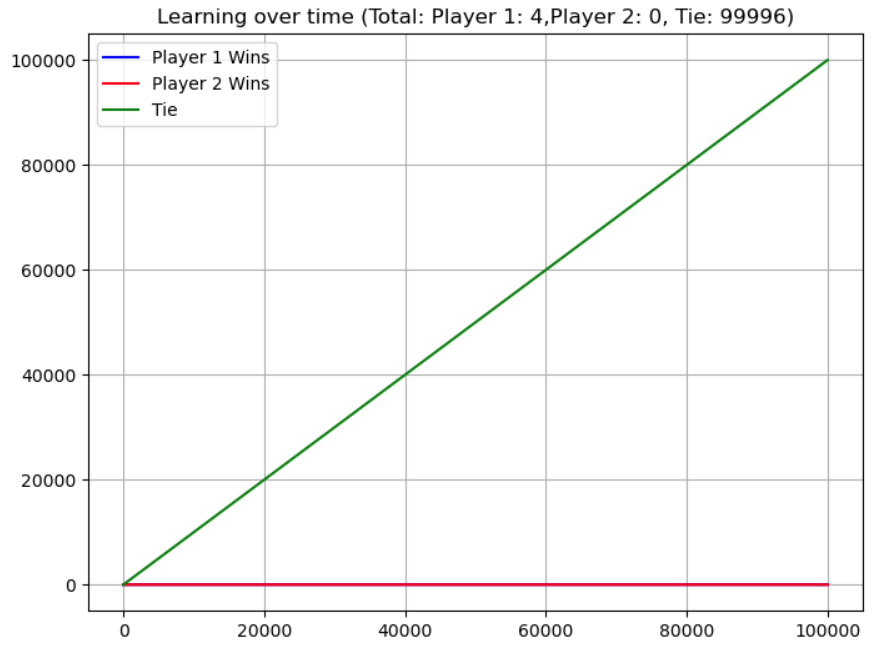

  

# Reinforcement Learning for LLMs

Since running DeepSeek on my own PC is impractical, I decided to learn the 
mathematics of reinforcement learning (RL) and implement them from scratch 
on simpler tasks. The best way to understand something is to build it yourself.

This notebook constructs RL concepts step by step, starting from Q-learning 
on Tic-Tac-Toe and progressing to advanced policy optimization methods 
like GRPO on the CartPole environment.

## Table of Contents

### 1. Tic-Tac-Toe - Two agents play against one another
- Q-Learning
- Monte Carlo Learning

### 2. CartPole - Learning to balance a pole
- Policy Gradient (REINFORCE)
- Actor-Critic
- Proximal Policy Optimization (PPO)
- Generalized Reinforcement Policy Optimization (GRPO)

Each section introduces the RL algorithm, provides a mathematical explanation, 
and implements it in code.
"""
